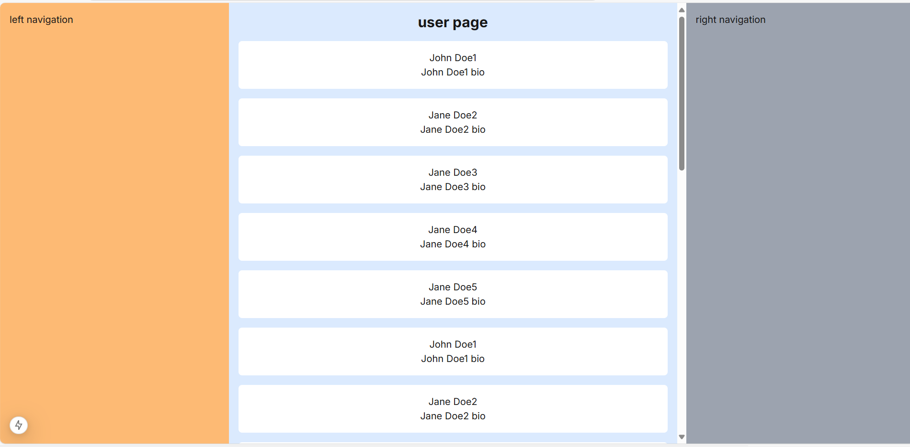

## Screenshots



## Installation

```
npm i listflow-react
yarn add listflow-react
pnpm add listflow-react

```

## Usage

```tsx
import { ListFlow } from "listflow-reacts";
interface User {
  id: number;
  name: string;
  bio: string;
}
const Demo = () => {
  return (
    <div className="w-[50%]">
      <div>Works page</div>

      <ListFlow<User>
        className={sty.demoContainer}
        request={async (params) => {
          const res = await userApi.getUserList(params);
          return {
            data: res.data,
          };
        }}
        params={{
          pageSize: 10,
          ...
        }}
        renderItem={(item) => (
          <div className="flex flex-col justify-center items-center p-4 bg-white rounded-md">
            <div>{item.name}</div>
            <div>{item.bio}</div>
          </div>
        )}
      />
    </div>
  );
};
```

## props

#### request

     type: (pageParams: PageParams) => Promise<any>;
     default:require
     description: Request function that must return a promise

#### renderItem

    type: (item: T) => ReactNode;
    default:require
    description: Render function that must return a ReactNode

#### params

    type: Record<string, any>;
    default:{}
    description: Request parameters

#### className

    type: string;
    default:''
    description: Component style class name

#### loadingComponent

    type: ReactNode;
    default:<div>Loading...</div>
    description: Loading component

#### emptyComponent

    type: ReactNode;
    default:<div>No Data</div>
    description: Component rendered when there is no data

#### loadingMoreComponent

    type: ReactNode;
    default:<div>Loading More...</div>
    description: Loading more component

#### errorComponent

    type: ReactNode;
    default:<div>Loading failed, please try again later</div>
    description: Component rendered when there is an error during loading

#### noMoreComponent

    type: ReactNode;
    default:<div>No More Data</div>
    description: Component rendered when there is no more data

#### initialErrorComponent

    type: ReactNode;
    default:<div>Loading failed, please try again later</div>
    description: Component rendered when there is an error during initial loading

## Example

```tsx
import { ListFlow } from "listflow-reacts";

interface User {
  id: number;
  name: string;
  bio: string;
}
let count = 0;
const networkError = false;
const isEmpty = false;
const Demo = () => {
  const request = () => {
    return new Promise<{ data: User[] }>((resolve, reject) => {
      setTimeout(() => {
        count++;

        if (networkError) {
          return reject("error");
        }

        if (isEmpty) {
          return resolve({ data: [] });
        }

        if (count > 4 && count < 6) {
          return reject("error");
        }

        if (count > 10) {
          return resolve({
            data: [],
          });
        }
        resolve({
          data: [
            {
              id: 1,
              name: "John Doe1",
              bio: "John Doe1 bio",
            },
            {
              id: 2,
              name: "Jane Doe2",
              bio: "Jane Doe2 bio",
            },
            {
              id: 3,
              name: "Jane Doe3",
              bio: "Jane Doe3 bio",
            },
            {
              id: 4,
              name: "Jane Doe4",
              bio: "Jane Doe4 bio",
            },
            {
              id: 5,
              name: "Jane Doe5",
              bio: "Jane Doe5 bio",
            },
          ],
        });
      }, 1000);
    });
  };

  return (
    <div className="w-[50%]">
      <div>Works page</div>
      <ListFlow<User>
        request={request}
        renderItem={(item) => (
          <div style={{ backgroundColor: "#fff", borderRadius: "6px", padding: "16px" }}>
            <div>{item.name}</div>
            <div>{item.bio}</div>
          </div>
        )}
      />
    </div>
  );
};

export default Demo;
```
